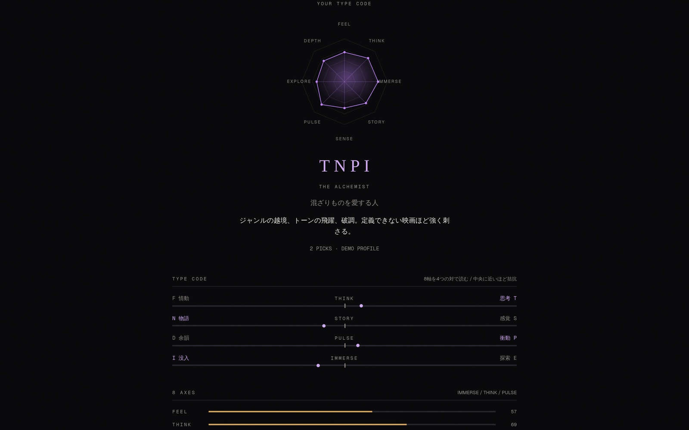
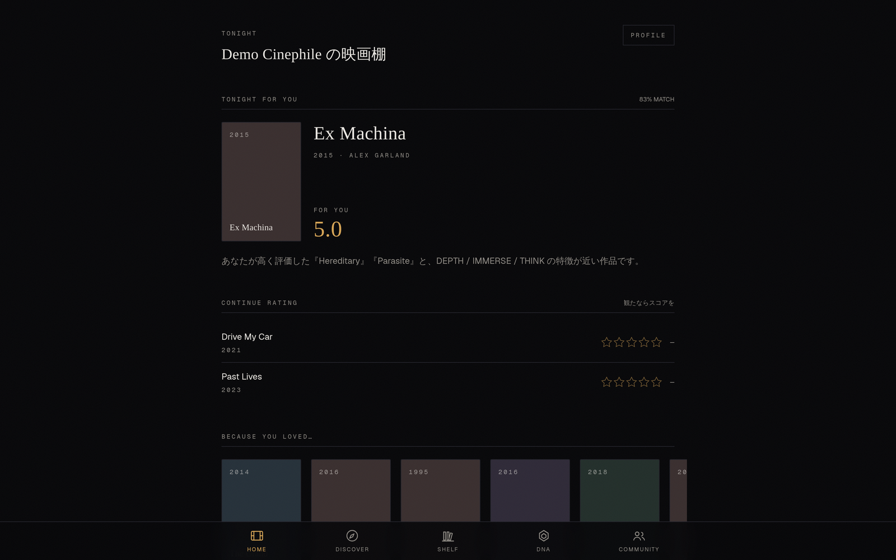
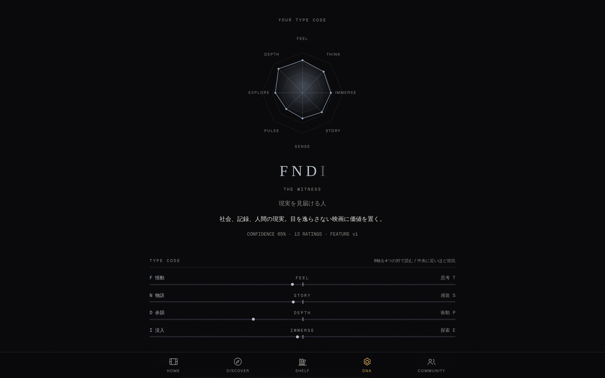
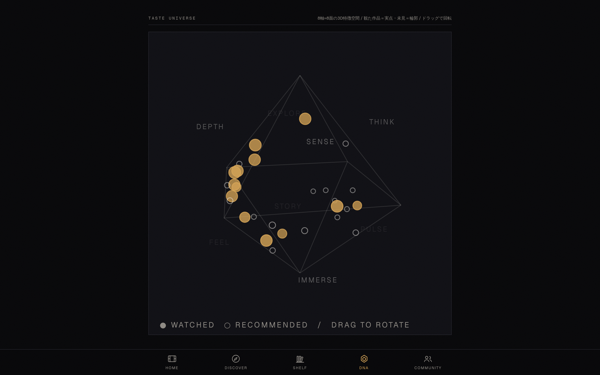
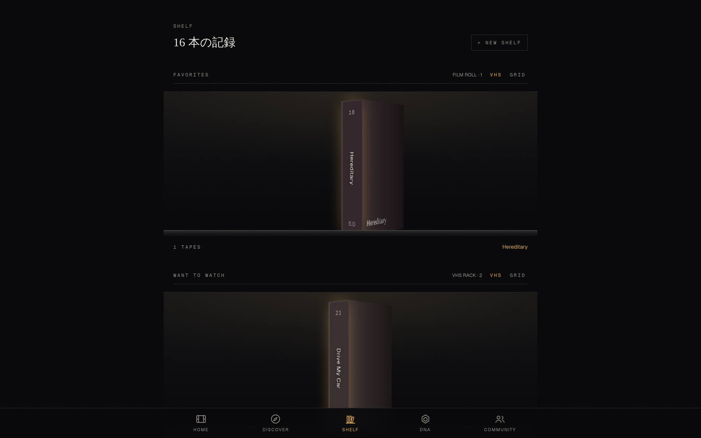
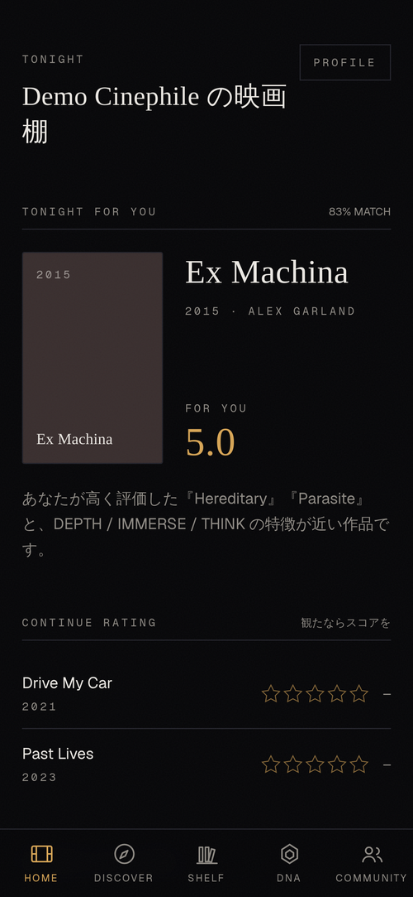
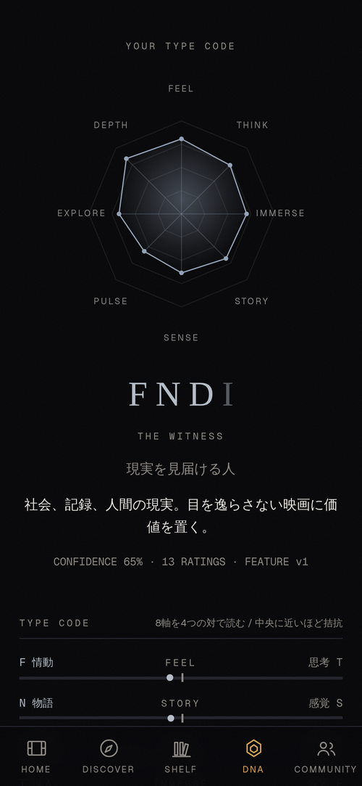

# スカイネット（SKYNET）

**観た映画に星をつけるだけで、それがそのまま「自分の紹介文」になるアプリ。**

映画を探す場所ではなく、あなたの映画人生をつくる場所です。
記録アプリ（観た作品を残す）・配信サービスのおすすめ（次に観る作品を出す）・16 タイプの性格診断
（自分を一言で説明する）を、ひとつの体験にまとめました。

- 星をつける → 好みが 8 つの言葉に置き換わる → **4 文字のタイプコード**（例 `TSPE`）と 16 種類のタイプ名が出る
- 同じ好みからおすすめを出し、**予想評価・相性・自信度・一言の理由**を添える（おすすめの一覧行と作品ページ）
- 観た映画は棚に並び、プロフィールとして人に見せられる

## 触ってみる

| 方法 | 手順 |
| --- | --- |
| **ログイン不要のデモ** | アプリの `/demo` を開き、好きな映画を 2 本以上選ぶ。その場でタイプコードと好みの図が出ます |
| デモアカウント | `demo@personal.cinema` / `cinema2024`（評価・棚・おすすめが入った状態） |
| 手元で動かす | 下の「1 分で動かす」。API キーなしでも同梱のモックカタログ（36 作品）で全機能が動きます |

## 画面

| ログイン不要デモ：選んだ映画から 4 文字コード | ホーム：理由つきの「今夜の一本」 |
| --- | --- |
|  |  |

| 好みの図：8 軸と 4 文字コードの内訳 | 回せる好みマップ |
| --- | --- |
|  |  |

| 棚：観た映画を VHS のケースで並べる | スマホ（ホーム / 好みの図） |
| --- | --- |
|  |   |

## 審査項目とこのリポジトリの対応

| 審査項目 | 見どころ | 該当セクション |
| --- | --- | --- |
| スポンサーツール活用度 | Supabase = 15 テーブルの保存先 + ウォッチルームの Realtime。Devin = 実装のほぼ全量（29 PR / 約 7,500 行） | [スポンサーツールの使い方](#スポンサーツールの使い方) |
| 完成度 / 動作 | ログイン不要デモ、7 画面 + 映画詳細 + 共同視聴、スマホにインストール可能、TMDB キーなしでも動く | [できること](#できること) / [1 分で動かす](#1-分で動かす) |
| アイデア / 独創性 | 「作品を並べる」ではなく「あなたを描く」。評価を重ねるほど育つタイプ判定と、理由つきのおすすめ | [既存のサービスとの違い](#既存のサービスとの違い) |
| 課題解決 / インパクト | たくさん観ているのに「好きな映画は？」に答えられない人のための、説明できる自己紹介 | [解決したい課題](#解決したい課題) |
| プレゼンテーション | 8 分の発表台本つきスライド（`docs/slides/pitch.md`）と、この README の上から順の説明 | [発表スライド](#発表スライド) |

## 解決したい課題

- 記録アプリに星をつけても、残るのは**作品ごとの点数**だけで、自分の好みは言葉にならない
- 配信サービスのおすすめは出るが、**なぜ勧められたのか分からない**ので観る気にならない
- 結果、月に何本も観ている人ほど「好きな映画は？」に一言で答えられない

対象は、月に 2〜3 本は映画を観るが感想は書かない人。欲しいのは検索窓ではなく、自分を映す鏡です。

## できること

| 画面 | できること |
| --- | --- |
| ログイン不要デモ（`/demo`） | 好きな映画を選ぶだけで、タイプコードと好みの図をその場で表示 |
| 最初の設定（`/onboarding`） | 数本に星をつけると好みが計算され、タイプが提示される |
| ホーム | 今のタイプ、好みの図、次に観る候補 |
| 見つける | 気分別の並びと、理由つきのおすすめ |
| 棚 | 観た作品を VHS のケースに見立てて並べる（標準棚 3 つ + 自作の棚） |
| 好みの図 | 8 軸のグラフ、回せる 3D の好みマップ、4 文字コードの内訳メーター |
| コミュニティ | 感想（ネタバレ隠し）、いいね、フォロー、フィード |
| 共同視聴（`/room/[id]`） | 同じ映画を観ている人と、再生位置つきで反応を送り合う |
| プロフィール（`/u/[userId]`） | 自分のタイプ・好み・棚を人に見せる |

スマホの「ホーム画面に追加」でアプリとして入り、通信が切れても最低限の画面が開きます。

## 既存のサービスとの違い

| いま使われているもの | できること | 足りないこと |
| --- | --- | --- |
| 映画の記録アプリ（Filmarks / Letterboxd） | 観た作品と点数を残す | 自分の好みは言葉にならない |
| 配信サービスのおすすめ（「一致度 96%」の表示） | 次に観る作品を出す | 理由が出ない・記録は残らない |
| 16 タイプの性格診断 | 自分を一言で説明できる | 一度やったら終わり |
| 記録の分析ツール（Letterboxd の履歴を読み込む類） | 1 年分をまとめて振り返る | 使い続ける場所ではなく、おすすめにもつながらない |

このアプリは 3 つを 1 つにまとめ、**星をつける操作だけ**で全部が育ちます。タイプは観るたびに更新され、
おすすめの理由は「あなたが 4.5 をつけた〇〇に近い」という形で、同じ好みの言葉から説明されます。

### 好みの表し方

映画も人も、同じ 8 つの言葉で表します（情動 / 思考 / 没入 / 物語 / 映像美 / 疾走感 / 探索 / 余韻）。
この 8 つを対になる 4 組にまとめ、どちら側に寄っているかで 4 文字のコードになります。

| 組 | 文字 |
| --- | --- |
| 思考 ↔ 情動 | `T` / `F` |
| 映像美 ↔ 物語 | `S` / `N` |
| 疾走感 ↔ 余韻 | `P` / `D` |
| 探索 ↔ 没入 | `E` / `I` |

ほぼ互角の組は文字を薄く表示し、決めつけないようにしています（`src/lib/dna/code.ts`）。
性格診断の 4 文字表記に似せた見せ方ですが、質問には答えません。**評価した映画だけ**から計算します。

## スポンサーツールの使い方

### Supabase

- ユーザーのデータ（評価・棚・好み・感想・フォロー・共同視聴）は**全 15 テーブルすべて Supabase 上の Postgres に保存**
- 手元では SQLite、本番は Supabase に**接続文字列 1 つで切り替わる**（`scripts/sync-prisma-schema.mjs` が
  Prisma のスキーマを書き換えるので、コードは 1 行も変えない）
- 共同視聴の反応は **Supabase Realtime** で配信。ただし Realtime は「この部屋が変わった」という
  呼び鈴だけを流し、中身は必ず自分の API から読み直す設計（`src/lib/rooms/realtime.ts`）。
  鍵が無い環境では自動で 3 秒ごとの確認に落ちるので、ローカルでも同じ画面が動く
- 接続の使い分けまで詰めてある（下記「運用で分かったこと」）。**発表当日に落ちないこと**を優先しました

### Devin

- 企画書を渡すところから始め、**アプリの実装はほぼ全量 Devin が作成**（現在 `src/` は 84 ファイル / 約 7,500 行）
- 進め方は「チャットで指示 → 差分を PR で確認 → 直して取り込む」。**29 本の PR** に作業単位が残っています
- 直したのは機能だけではありません。速度（1 ページ 20 件のクエリを並列化、DB を近いリージョンに寄せる）、
  スマホの操作感（指で回せる好みマップ、棚のスクロール）、この README と発表スライドも Devin が書いています
- 人がやったのは「何を作るか」「どこが分かりにくいか」を決めることだけです

## 1 分で動かす

```bash
npm install
cp .env.example .env      # 何も書かなくても動きます（AUTH_SECRET は開発用の既定値）
npm run setup             # スキーマ生成 + DB 作成 + デモデータ投入
npm run dev               # http://localhost:3000
```

デモアカウント: `demo@personal.cinema` / `cinema2024`

TMDB のキーが無いときは同梱のモックカタログ（36 作品）で全機能が動きます。
ログイン不要デモ（`/demo`）の候補は、特徴づけが済んだ作品だけを出します（シード直後は 12 本前後、
作品ページを開くほど増えます）。全作品を先に取り込まない仕組みのためで、動作には影響しません。
OpenAI のキーが無いときは、映画の特徴づけが決まった規則だけになります（動作は同じ）。

### スマホ / ブラウザだけで開発する（GitHub Codespaces）

リポジトリの **Code → Codespaces → Create codespace** から起動すると、`.devcontainer` が
依存インストール・`.env` 生成・DB シードまで自動で行います。起動後は `npm run dev`、
転送された 3000 番ポートの URL をブラウザで開けます。

TMDB を使う場合は、リポジトリ設定の **Settings → Secrets and variables → Codespaces** に
`TMDB_API_KEY` を登録してから codespace を作成してください（未登録ならモックカタログで動作）。

なお、このアプリはサーバー処理（Server Actions / API Route / DB）が必須のため、
静的配信のみの GitHub Pages では動作しません。

### 本番として動かす（Vercel + Supabase）

すべてスマホのブラウザだけで完了します。

[](https://vercel.com/new/import?s=https%3A%2F%2Fgithub.com%2Fkuretechi%2FSkynet&project-name=skynet&env=DATABASE_URL,AUTH_SECRET,TMDB_API_KEY&envDescription=DATABASE_URL%3A%20Supabase%20%E3%81%AA%E3%81%A9%20Postgres%20%E3%81%AE%E6%8E%A5%E7%B6%9A%E6%96%87%E5%AD%97%E5%88%97%20%2F%20AUTH_SECRET%3A%20%E4%BB%BB%E6%84%8F%E3%81%AE%E3%83%A9%E3%83%B3%E3%83%80%E3%83%A0%E6%96%87%E5%AD%97%E5%88%97%20%2F%20TMDB_API_KEY%3A%20TMDB%20%E3%81%AE%20API%20%E3%82%AD%E3%83%BC&envLink=https%3A%2F%2Fgithub.com%2Fkuretechi%2FSkynet%23%E7%92%B0%E5%A2%83%E5%A4%89%E6%95%B0)

1. Supabase でプロジェクトを作り、**Connect → Transaction pooler** の URI をコピー
   （`postgres.<ref>@aws-N-<region>.pooler.supabase.com:6543`）
2. 上の **Deploy** ボタン（Vercel の Import 画面が開きます）
3. Environment Variables に設定して Deploy
   - `DATABASE_URL` = 1 でコピーした接続文字列
   - `AUTH_SECRET` = 任意の 32 バイト以上のランダム文字列
   - `TMDB_API_KEY` = TMDB の API キー（省略時はモックカタログ）
   - `NEXT_PUBLIC_SUPABASE_URL` / `NEXT_PUBLIC_SUPABASE_ANON_KEY` = 共同視聴を Realtime で更新する場合
4. 発行された `https://<project>.vercel.app` をスマホで開き、共有メニューから「ホーム画面に追加」

`DATABASE_URL` が `postgres://` / `postgresql://` で始まると Prisma の datasource が自動で
PostgreSQL に切り替わります（`scripts/sync-prisma-schema.mjs`）。ローカルはそのまま SQLite です。
スキーマ反映は Vercel のビルド（`vercel-build`）で `prisma db push` が実行されます。
デモデータが必要なら、接続文字列を `DATABASE_URL` に入れてローカルで `npm run db:seed` を実行してください。

#### 運用で分かったこと（Supabase の接続の使い分け）

- **Direct connection**（`db.<ref>.supabase.co:5432`）は IPv6 のみで解決されるため、
  IPv4 しか持たない実行環境（Vercel の関数など）からは到達できない
- Postgres の実行時接続は node-postgres ドライバアダプタ経由（`src/lib/db.ts`）。
  Prisma 標準のエンジン経路は PgBouncer 相手に 1 クエリあたり 5 往復するため、
  レイテンシがそのまま 5 倍になる。アダプタなら 1 往復で済む
- `connection_limit=1` は付けない（付いていても実行時に外す）。1 ページで 20 件前後の
  クエリを並列に投げるため、接続が 1 本だとプール待ちでレンダリングが止まる
- `prisma db push` は同じホストの **5432**（session pooler）へ自動で振り替えられる
  （`scripts/db-push.mjs`）。5432 は同時接続数が小さいのでアプリの実行時には使わない
- session pooler は 15 クライアントまでなので、アプリに負荷がかかっている最中の
  デプロイは `EMAXCONNSESSION` で弾かれることがある。ビルド時の push は最大 6 回
  （合計約 2.5 分）リトライするので、通常はそのまま復帰する
- Vercel の関数リージョンは `vercel.json` で `sin1`（Singapore）に固定している。
  DB のラウンドトリップが体感速度を決めるので、Supabase のリージョンを
  変えたときは同じ場所の Vercel リージョンに合わせて変更する

## 中身の構成

| 役割 | 場所 | 説明 |
| --- | --- | --- |
| 映画データの取得 | `src/lib/movies/` | TMDB と同梱モックを差し替え可能にした層 |
| 触れた映画だけ保存 | `src/lib/movies/repository.ts` | 全作品を同期せず、ユーザーが開いた作品だけ DB に取り込む |
| 映画の特徴づけ | `src/lib/features/` | 決まった規則（ジャンル・キーワード・上映時間）＋任意の AI 分類。バージョン管理あり |
| 好みの計算 | `src/lib/dna/` | 評価履歴 × 映画の特徴から 8 軸の数値、16 タイプ、4 文字コード |
| おすすめ | `src/lib/recommend/` | 8 軸の近さで並べ替え、外部の平均点は弱い参考値としてだけ使う |
| 共同視聴 | `src/lib/rooms/` | Realtime の通知 + 自分の API からの読み直し |
| DB 接続 | `src/lib/db.ts` | SQLite / Postgres の切り替えと接続の使い分け |

ユーザー自身のデータ（評価・棚・好み・感想）と、外から取ってきたデータ（TMDB のキャッシュ、外部の点数）は
テーブルの段階で分けています。

### コード内の呼び名と、説明での言い方

スライドや説明では造語を使いません。コードを読むときの対応表です。

| コード上の名前 | 説明での言い方 |
| --- | --- |
| Cinema DNA / 8 axes | 好みを表す 8 つの言葉 |
| CineType | 16 種類のタイプ名 |
| Type Code | 4 文字のコード |
| Cinema Crystal / Taste Universe | 好みを表す図 / 回せる好みマップ |
| For You Score | 予想評価・相性・自信度・理由の 4 点セット |
| Shelf / Motif | 棚 / 棚の見た目 |
| Lazy Cache | 触れた映画だけ保存する仕組み |

## 環境変数

| 変数 | 未設定時の挙動 |
| --- | --- |
| `TMDB_API_KEY` | 同梱のモックカタログ（36 作品）で動作 |
| `OPENAI_API_KEY` | 特徴量生成が決定論ルールのみになる |
| `AUTH_SECRET` | 開発用の固定鍵にフォールバック（本番では必ず設定） |
| `DATABASE_URL` | 未設定なら `.env` の SQLite（`file:./dev.db`）。Postgres URL を渡すと PostgreSQL に切り替わる |
| `DB_POOL_MAX` | インスタンスあたりの Postgres 接続上限（既定 30）。同時アクセスが多いイベントでは増やす |
| `NEXT_PUBLIC_SUPABASE_URL` / `NEXT_PUBLIC_SUPABASE_ANON_KEY` | ウォッチルームが Supabase Realtime を使わず 3 秒ポーリングで更新される |
| `CRON_SECRET` | 日次メンテナンス（`/api/cron/refresh`）が 503 を返して動かない |

TMDB を利用する場合は、TMDB の最新の利用条件とアトリビューション要件に従ってください。
外部映画サイトのスクレイピングは行いません。

## 日次メンテナンス

`vercel.json` の cron が毎日 `/api/cron/refresh` を叩き、次の作業をまとめて行います（`Authorization: Bearer $CRON_SECRET` が必要）。

- 公開中・人気の新作をカタログに取り込み、8 軸の特徴量を生成
- 14 日以上前に取得した作品メタデータを再取得して特徴量を作り直す（評価・レビュー・棚はそのまま）
- 閉じ忘れたウォッチルームを終了させ、90 日より古い終了済みルームを削除
- 無操作が続くと停止する Postgres（Supabase 無料枠など）へ定期的に接続する

Vercel 以外で動かす場合は、同じエンドポイントを任意のスケジューラから叩けば同じ結果になります。

```bash
curl -H "Authorization: Bearer $CRON_SECRET" https://<your-app>/api/cron/refresh
```

## スクリプト

```bash
npm run dev        # 開発サーバー
npm run build      # 本番ビルド
npm run lint       # ESLint
npm run typecheck  # tsc --noEmit
npm run db:seed    # デモデータ投入
```

## 発表スライド

`docs/slides/pitch.md`（Marp / 8 分発表 + 質疑 2 分。各スライドに持ち時間と話す内容のメモつき）。
md を更新したら `npm run slides:pdf` で `docs/slides/pitch.pdf` を再生成してコミットします。

## 仕様書で TBD の項目

`src/lib/config.ts` に暫定値としてまとめてあります（オンボーディングの評価本数など）。
プロダクト仕様として確定したものではありません。
